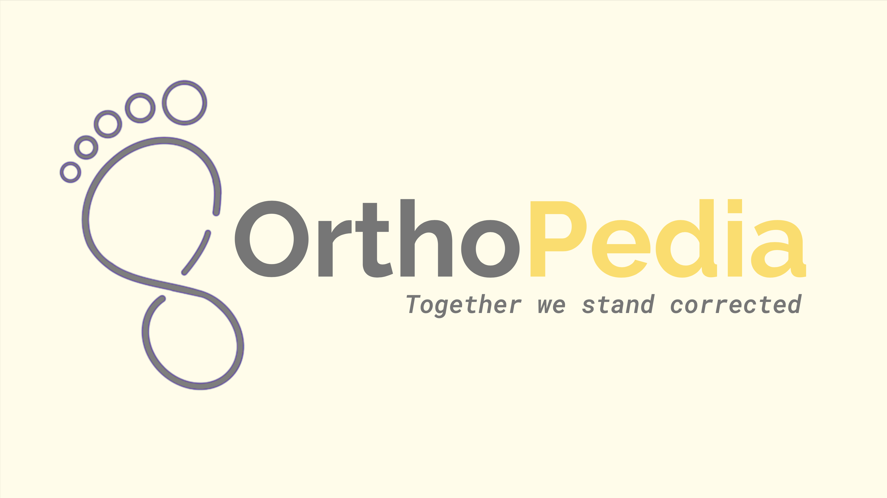
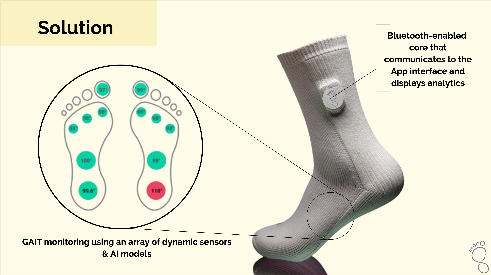
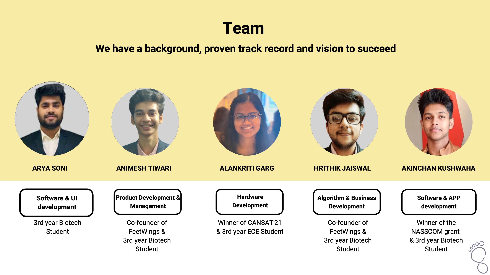

  

<h1 align="center">Ortho Pedia</h1>

Together we stand corrected

## Ortho Pedia

OrthoPedia is a smart podiatry company that caters to the need of patients that are at risk of GAIT instability due to amputations or surgeries by the use of affordable and compliance-free smart socks that provide real-time analytics, thus, restricting the aggravation of these comorbidities to severe back pain, spinal injury and neurodegenerative diseases.

---
## Problem

Patients with amputations, limb surgeries & prosthetic appendages are at a risk of GAIT variation and instability leading to crippling ailments like back pain, spinal injuries, and even neurodegenerative diseases which affect the patient's mobility and hence their quality of life.

- Prosthetics Surgery & Amputations
- GAIT Variation & Instability
- Neurodegenerative Diseases, Spinal Injury & Back Pain

---

  

## Product Workflow

- Hardware collecting data in real-time
- Data is pre-processed by the algorithm
- Anomaly and GAIT variations are observed
- - Recommendations given for personalised insoles
- - Analytics shown to the user
- - Early alerts raised for preventive care

---

  

